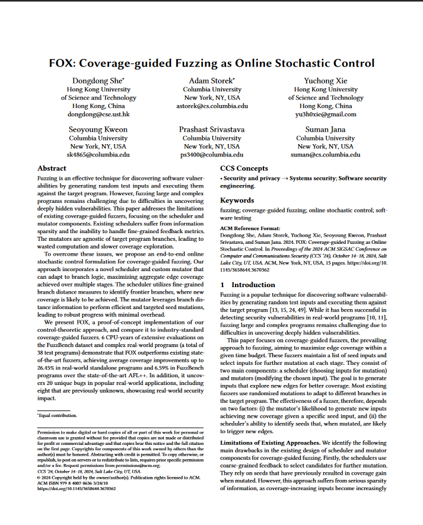

# FOX - Coverage-guided Fuzzing as Online Stochastic Control

<a href="https://arxiv.org/abs/2406.04517" target="_blank"></a>

FOX presents a control-theoretic approach to perform coverage-guided fuzzing. The current prototype is built on top of [AFL++](https://github.com/AFLplusplus/AFLplusplus/).
The key features implemented by FOX are:
- Custom scheduler logic: Scheduling is done over frontier branches instead of seeds.
- Custom mutator logic: Mutations adopt Newton's search method to synthesize branch-flipping inputs.
- Changes to the LLVM instrumentation pass to allow efficient branch distance calculation

This project is accepted at CCS'24 and will be presented there. Checkout our [paper](https://arxiv.org/abs/2406.04517) for more technical details about the project.
Refer to the instructions present in `artifact/` where we provide detailed instructions to reproduce our experimental results
and also detail instructions on how to run FOX on new targets.   
<br/>
# Cite
```bibtex 
@inproceedings{she2024fox,
  title={FOX: Coverage-guided Fuzzing as Online Stochastic Control},
  author={She, Dongdong and Storek, Adam and Xie, Yuchong and Kweon, Seoyoung and Srivastava, Prashast and Jana, Suman},
  booktitle={Proceedings of the 2024 ACM SIGSAC Conference on Computer and Communications Security},
  year={2024}
}
```
